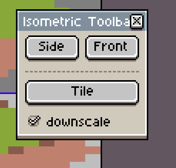
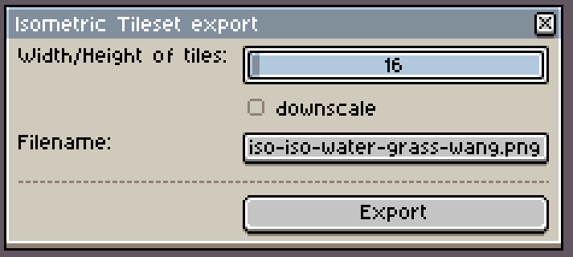
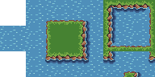
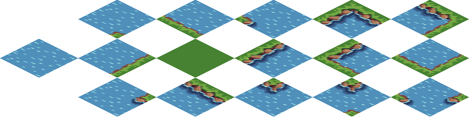

# Isometric aseprite scripts 

## square-to-isometric-tile
Converts a square tile to an isometric tile.  

## square-to-isometric-front
Converts a selection to an isometric front tile, like a wall.  

## square-to-isometric-side
Converts a selection to an isometric side tile, like a wall.  

## isometric helper
All this above is included in a more handy toolbar, that will stay open when you working with your tileset or isometric graphic.  
  

## iso tileset export
Export an whole image to isometric tiles.  

  
The export will result in a 4x size so a orthographic tile of size 16 pixel will become 64x32 pixels. But the downsize will shrink that so the size till be 32x16 instead.  

  
This is an orthograpgic tileset example 

  
The orthographic tileset exported to isometric tiles.  

  
And this is an example when the new tileset is used to create som lovely islands.
