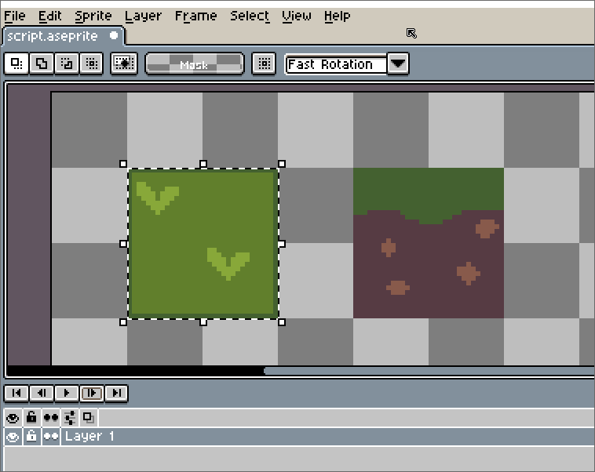
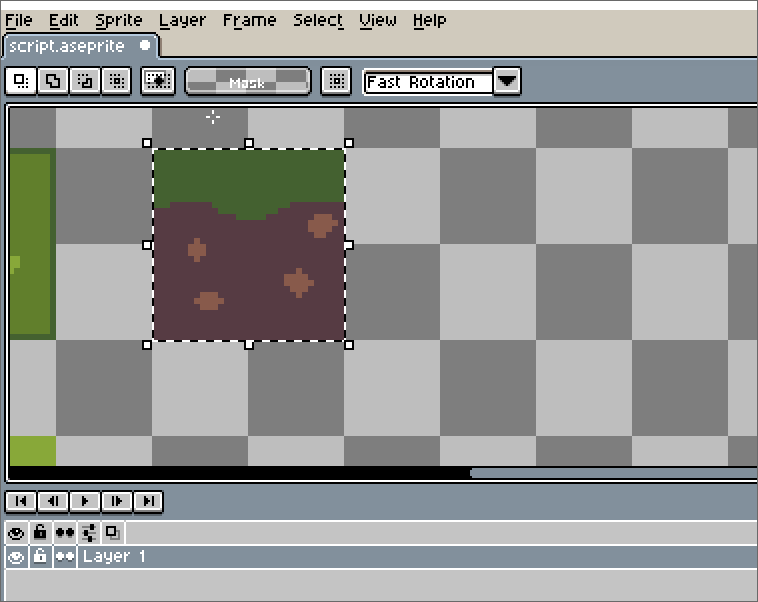
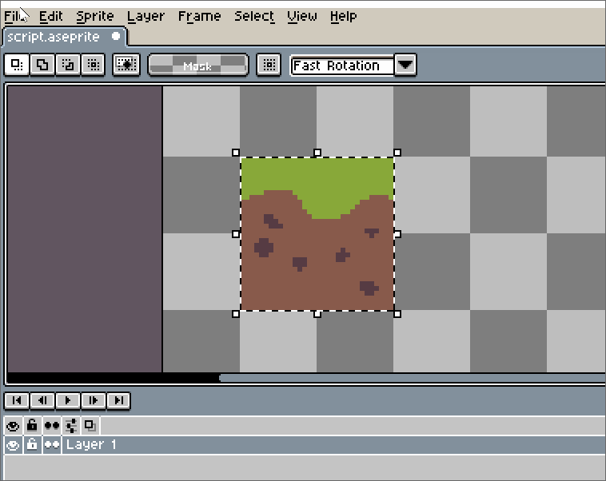

# Isometric aseprite scripts 

## square-to-isometric-tile
Converts a square tile to an isometric tile.  

## square-to-isometric-front
Converts a selection to an isometric front tile, like a wall.

## square-to-isometric-side
Converts a selection to an isometric side tile, like a wall.
